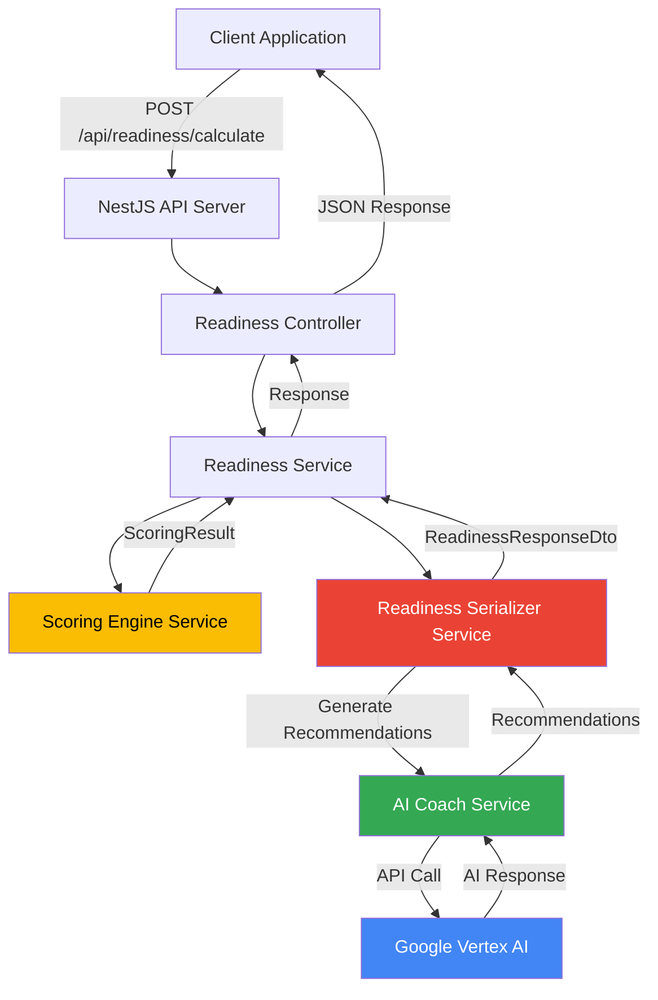
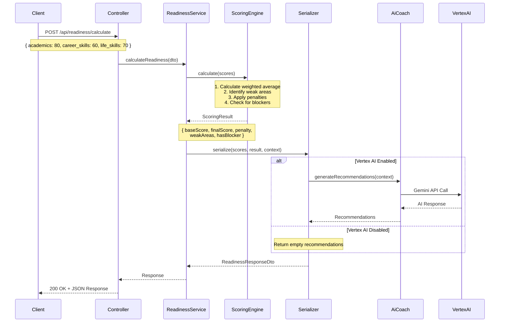

# Post-School Success Platform (PSSP) - Readiness Score API

Backend API service that calculates personalized readiness scores for learners across academics, career skills, and life skills. Built with NestJS, TypeScript, and Google Vertex AI.

## Table of Contents

- [Getting Started](#getting-started)
- [API Documentation](#api-documentation)
- [Architecture](#architecture)
- [Scoring Logic](#scoring-logic)
- [Testing](#testing)
- [Design Decisions](#design-decisions)
- [Loom Walkthrough](#loom-walkthrough)

## Architecture

### System Architecture



### Request Flow



### Module Structure

```
src/
├── modules/
│   ├── readiness/              # Core readiness scoring
│   │   ├── controllers/        # HTTP endpoints
│   │   ├── services/           # Business logic
│   │   └── dto/                # Data transfer objects
│   └── ai-coach/               # AI recommendation engine
│       ├── services/           # Vertex AI integration
│       └── dto/
├── common/                     # Shared components
│   ├── decorators/
│   ├── filters/
│   ├── guards/
│   └── interceptors/
├── shared/
│   ├── types/
│   ├── utils/                  # Scoring logic
│   └── interfaces/
└── config/                     # Configuration
```

## Getting Started

### Prerequisites

- Node.js 20.x or higher
- npm 9.x or higher
- Google Cloud Platform account with Vertex AI API access (optional for AI features)

### Installation

```bash
# Clone repository
git clone https://github.com/victorpreston/pssp-backend.git
cd pssp-backend

# Install dependencies
npm install

# Configure environment
cp .env.example .env
```

Edit `.env`:

```env
PORT=3000
NODE_ENV=development

# Vertex AI credentials (JSON string or file path)
GOOGLE_SERVICE_ACCOUNT_JSON='{"type":"service_account","project_id":"..."}'
VERTEX_AI_PROJECT_ID=your-gcp-project-id
VERTEX_AI_LOCATION=us-central1
VERTEX_AI_MODEL=gemini-2.0-flash-exp
ENABLE_VERTEX_AI=true
```

### Run Application

```bash
# Development
npm run start:dev

# Production
npm run build
npm run start:prod
```

API: `http://localhost:3000` | Docs: `http://localhost:3000/docs`

### Docker

```bash
docker build -f docker/Dockerfile.nest -t pssp-backend .
docker run -p 3000:3000 --env-file .env pssp-backend
```

## API Documentation

**Interactive Swagger UI:** `http://localhost:3000/docs`

### Calculate Readiness Score

`POST /api/readiness/calculate`

**Request:**

```json
{
  "learner_id": "L001",
  "academics": 80,
  "career_skills": 60,
  "life_skills": 70,
  "details": {
    "academics": {
      "stem_proficiency": 85,
      "literacy": 75,
      "critical_thinking": 80
    },
    "career_skills": {
      "resume_building": 70,
      "interview_prep": 50,
      "networking": 60
    },
    "life_skills": {
      "time_management": 75,
      "communication": 70,
      "financial_literacy": 65
    }
  },
  "context": {
    "program": "TGP",
    "goal": "software_engineering",
    "modules_completed": 12,
    "engagement_score": 85
  },
  "previous_scores": [{ "date": "2024-11-01", "overall": 62 }]
}
```

**Response:**

```json
{
  "success": true,
  "data": {
    "overall_score": 70,
    "readiness_level": "Building",
    "category": "Intermediate",
    "breakdown": {
      "academics": {
        "score": 80,
        "weight": 0.35,
        "contribution": 28,
        "status": "strong"
      },
      "career_skills": {
        "score": 60,
        "weight": 0.4,
        "contribution": 24,
        "status": "building"
      },
      "life_skills": {
        "score": 70,
        "weight": 0.25,
        "contribution": 17.5,
        "status": "building"
      }
    },
    "insights": {
      "strengths": ["academics"],
      "growthAreas": [],
      "trend": "improving (+8 points)",
      "estimatedTimeToReady": "3-5 weeks"
    },
    "ai_recommendations": [
      {
        "category": "career_skills",
        "priority": "high",
        "recommendation": "Build portfolio projects",
        "action_items": [
          {
            "action": "Complete 2-3 full-stack projects",
            "timeframe": "4 weeks"
          }
        ],
        "resources": [
          {
            "title": "The Odin Project",
            "type": "course",
            "url": "https://..."
          }
        ]
      }
    ]
  }
}
```

### Health Check

`GET /api`

```json
{
  "success": true,
  "data": {
    "status": "healthy",
    "service": "Post-School Success Platform API",
    "version": "1.0.0"
  }
}
```

## Scoring Logic

### Calculation Formula

```
Base Score = (Academics × 0.35) + (Career Skills × 0.40) + (Life Skills × 0.25)
Penalty = 5% of base score per weak area (score < 60)
Final Score = Base Score - Penalty
```

**Weights Rationale:**

- Career Skills (40%): Primary job readiness indicator
- Academics (35%): Learning foundation
- Life Skills (25%): Workplace success enabler

### Blocker Detection

Any category < 40 triggers "Not Ready" status, overriding other calculations.

### Readiness Levels

- **Ready** (75+): Strong across all areas
- **Building** (60-74): Solid foundation
- **Developing** (40-59): Needs focused improvement
- **Starting** (0-39): Requires significant development
- **Not Ready**: Critical gap present (blocker)

### AI Recommendations

When enabled, Vertex AI (Gemini 2.0 Flash) generates:

- 3-5 targeted recommendations
- Priority levels (high/medium/low)
- Specific action items with timeframes
- Learning resources
- Estimated impact time

## Testing

```bash
npm test              # Unit tests
npm run test:e2e      # E2E tests
npm test -- --coverage # Coverage report
```

**Coverage:** 73 tests (62 unit + 11 E2E)

- Scoring utilities (33 tests)
- Service layer (28 tests)
- API endpoints (11 tests)
- Controllers (1 test)

**CI/CD:** GitHub Actions runs tests on every push/PR (`.github/workflows/ci.yml`)

## Design Decisions

### 1. In-Memory Processing (No Database)

- Simplifies deployment and testing
- Focuses on API design and business logic
- Production: Add PostgreSQL/MongoDB for persistence

### 2. Weighted Scoring Algorithm

Career skills (40%) > Academics (35%) > Life skills (25%)

- Career skills predict job placement success
- Academic foundation essential but not sufficient
- Production: Configurable weights per program type

### 3. Penalty System (5% per weak area)

- Encourages balanced development
- Prevents gaming by excelling in one area only
- Production: Graduated penalties based on severity

### 4. Blocker Threshold (< 40)

- Clear intervention trigger for critical gaps
- Prevents advancement without fundamentals
- Production: Add improvement plans and grace periods

### 5. Optional Vertex AI Integration

- Works without GCP credentials (graceful degradation)
- Reduces costs in non-production environments
- Production: Add fallback rule-based recommendations

### 6. NestJS Framework

- Built-in dependency injection and modularity
- TypeScript-first with excellent type safety
- Automatic OpenAPI/Swagger documentation
- Robust testing utilities
- Production-ready architecture patterns
- Extensive ecosystem (microservices, GraphQL, WebSockets)

### 7. Synchronous AI Calls

- Simpler implementation and immediate feedback
- Easier debugging and testing
- Production: Async job queue with WebSocket updates

## Loom Walkthrough

**Video:** [Loom Walkthrough]

**Covers:** Project structure, request flow, scoring logic, Vertex AI integration, API demo, test coverage

---

**Built with:** NestJS, TypeScript, Google Vertex AI, Docker, Jest  
**Repository:** [github.com/victorpreston/pssp-backend](https://github.com/victorpreston/pssp-backend)  
**Swagger UI:** `http://localhost:3000/docs`
