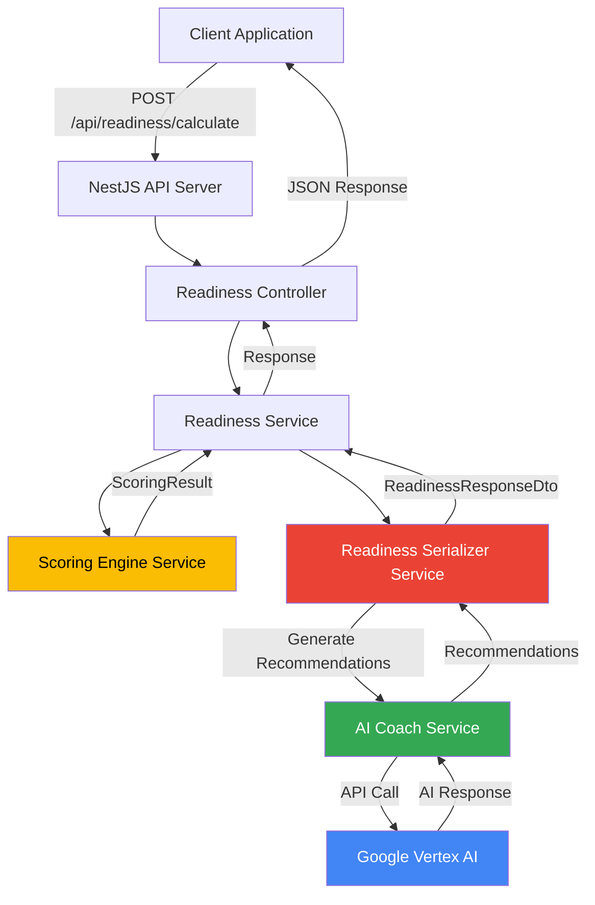
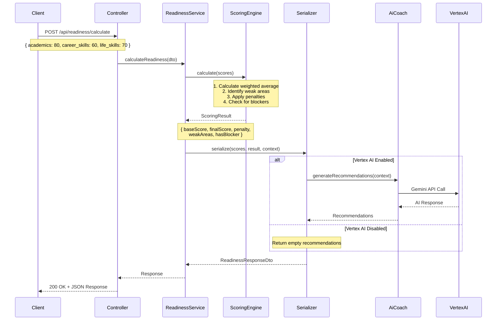
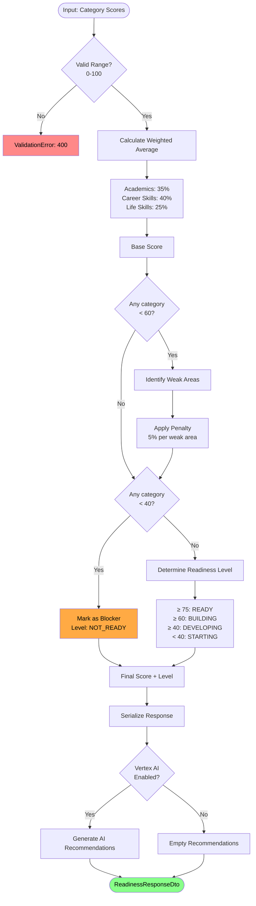
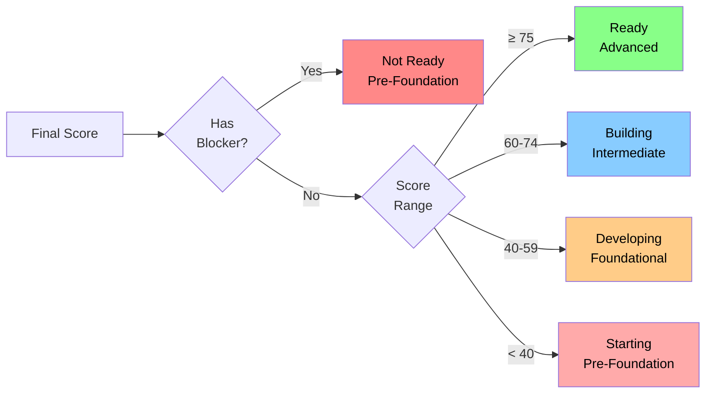
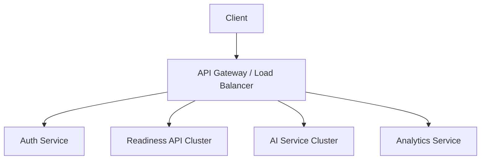

# Post-School Success Platform (PSSP) - Readiness Score API

A backend API service that calculates personalized readiness scores for learners based on their progress across academics, career skills, and life skills. Built with NestJS and TypeScript, featuring AI-powered recommendations through Google Vertex AI.

## Table of Contents

- [Overview](#overview)
- [Architecture](#architecture)
- [Getting Started](#getting-started)
- [API Documentation](#api-documentation)
- [Scoring Logic](#scoring-logic)
- [Testing](#testing)
- [Design Decisions & Tradeoffs](#design-decisions--tradeoffs)
- [Productionization & Scaling](#productionization--scaling)
- [Loom Walkthrough](#loom-walkthrough)

## Overview

The PSSP Readiness Score API provides:

- RESTful endpoint for calculating learner readiness scores
- Weighted scoring algorithm with penalty system for weak areas
- AI-powered personalized recommendations via Google Vertex AI
- Comprehensive insights including strengths, growth areas, and trends
- Interactive API documentation via Swagger UI at `/docs`

### Key Features

- **Intelligent Scoring**: Weighted average calculation with penalties for weak performance
- **Blocker Detection**: Identifies critical gaps that require immediate attention
- **AI Recommendations**: Context-aware suggestions powered by Google Vertex AI
- **Trend Analysis**: Tracks progress over time when historical data is provided
- **Production-Ready**: Includes Docker support, CI/CD pipeline, and comprehensive testing

## Architecture

### System Architecture



### Request Flow



### Module Structure

```
src/
├── modules/
│   ├── readiness/              # Core readiness scoring module
│   │   ├── controllers/        # HTTP endpoint handlers
│   │   ├── services/           # Business logic
│   │   │   ├── readiness.service.ts          # Orchestration
│   │   │   ├── scoring-engine.service.ts     # Score calculation
│   │   │   └── readiness-serializer.service.ts # Response formatting
│   │   ├── dto/                # Data transfer objects
│   │   └── readiness.module.ts
│   │
│   └── ai-coach/               # AI recommendation engine
│       ├── services/
│       │   ├── ai-coach.service.ts           # Recommendation generation
│       │   └── vertex-ai-client.service.ts   # Vertex AI integration
│       ├── dto/
│       ├── enums/
│       └── ai-coach.module.ts
│
├── common/                     # Common/shared application components
│   ├── decorators/             # Custom decorators
│   ├── filters/                # Exception filters
│   ├── guards/                 # Route guards
│   ├── interceptors/           # HTTP interceptors
│   ├── middleware/             # Custom middleware
│   └── pipes/                  # Validation pipes
│
├── shared/
│   ├── types/                  # Shared type definitions
│   ├── utils/                  # Utility functions (scoring logic)
│   └── interfaces/             # Shared interfaces
│
└── config/                     # Configuration modules
```

### Data Flow & Scoring Architecture



## Getting Started

### Prerequisites

- Node.js 20.x or higher
- npm 9.x or higher
- Google Cloud Platform account (for Vertex AI integration)
- Google Cloud service account with Vertex AI API access

### Installation

1. Clone the repository:

```bash
git clone https://github.com/victorpreston/pssp-backend.git
cd pssp-backend
```

2. Install dependencies:

```bash
npm install
```

3. Configure environment variables:

Create a `.env` file in the root directory (use `.env.example` as template):

```bash
cp .env.example .env
```

Edit `.env` with your configuration:

```env
# Application
PORT=3000
NODE_ENV=development

# Vertex AI (Option 1: JSON string - recommended for deployment)
GOOGLE_SERVICE_ACCOUNT_JSON='{"type":"service_account","project_id":"..."}'

# Vertex AI (Option 2: File path - recommended for local development)
# GOOGLE_APPLICATION_CREDENTIALS=/path/to/service-account-key.json

# Vertex AI Configuration
VERTEX_AI_PROJECT_ID=your-gcp-project-id
VERTEX_AI_LOCATION=us-central1
VERTEX_AI_MODEL=gemini-2.0-flash-exp
ENABLE_VERTEX_AI=true
```

### Running the Application

Development mode with hot-reload:

```bash
npm run start:dev
```

Production mode:

```bash
npm run build
npm run start:prod
```

The API will be available at `http://localhost:3000`

### Docker Deployment

Build and run with Docker:

```bash
# Build the image
docker build -f docker/Dockerfile.nest -t pssp-backend:latest .

# Run the container
docker run -p 3000:3000 --env-file .env pssp-backend:latest
```

Using Docker Compose:

```bash
# Development
docker-compose -f docker-compose.dev.yml up

# Production
docker-compose -f docker-compose.prod.yml up
```

## API Documentation

### Interactive Documentation

Access the Swagger UI documentation at:

```
http://localhost:3000/docs
```

The Swagger interface provides:

- Complete API endpoint documentation
- Request/response schemas
- Try-it-out functionality for testing
- Model definitions and examples

### Endpoints

#### Calculate Readiness Score

**Endpoint:** `POST /api/readiness/calculate`

**Description:** Calculates a learner's readiness score based on their progress across three categories.

**Request Body:**

```json
{
  "learner_id": "L001",
  "academics": 80,
  "career_skills": 60,
  "life_skills": 70,
  "details": {
    "academics": {
      "stem_proficiency": 85,
      "literacy": 75,
      "critical_thinking": 80
    },
    "career_skills": {
      "resume_building": 70,
      "interview_prep": 50,
      "networking": 60
    },
    "life_skills": {
      "time_management": 75,
      "communication": 70,
      "financial_literacy": 65
    }
  },
  "context": {
    "learner_id": "L12345",
    "program": "TGP",
    "goal": "software_engineering",
    "modules_completed": 12,
    "engagement_score": 85
  },
  "previous_scores": [
    {
      "date": "2024-11-01",
      "overall": 62
    }
  ]
}
```

**Request Schema:**

| Field                                    | Type   | Required | Constraints | Description                                              |
| ---------------------------------------- | ------ | -------- | ----------- | -------------------------------------------------------- |
| `learner_id`                             | string | Yes      | -           | Unique identifier for the learner                        |
| `academics`                              | number | Yes      | 0-100       | Academic performance score                               |
| `career_skills`                          | number | Yes      | 0-100       | Career readiness score                                   |
| `life_skills`                            | number | Yes      | 0-100       | Life skills score                                        |
| `details`                                | object | No       | -           | Detailed breakdown of scores within each category        |
| `details.academics`                      | object | No       | -           | Granular academic metrics                                |
| `details.academics.stem_proficiency`     | number | No       | 0-100       | STEM subject proficiency                                 |
| `details.academics.literacy`             | number | No       | 0-100       | Reading and writing skills                               |
| `details.academics.critical_thinking`    | number | No       | 0-100       | Analytical and problem-solving abilities                 |
| `details.career_skills`                  | object | No       | -           | Granular career readiness metrics                        |
| `details.career_skills.resume_building`  | number | No       | 0-100       | Resume creation and optimization skills                  |
| `details.career_skills.interview_prep`   | number | No       | 0-100       | Interview preparation and performance                    |
| `details.career_skills.networking`       | number | No       | 0-100       | Professional networking abilities                        |
| `details.life_skills`                    | object | No       | -           | Granular life skills metrics                             |
| `details.life_skills.time_management`    | number | No       | 0-100       | Time organization and prioritization                     |
| `details.life_skills.communication`      | number | No       | 0-100       | Interpersonal communication skills                       |
| `details.life_skills.financial_literacy` | number | No       | 0-100       | Financial planning and management                        |
| `context`                                | object | No       | -           | Additional context for AI recommendations                |
| `context.learner_id`                     | string | No       | -           | Learner identifier for context                           |
| `context.program`                        | string | No       | -           | Academic program or track (e.g., "TGP")                  |
| `context.goal`                           | string | No       | -           | Career goal or aspiration (e.g., "software_engineering") |
| `context.modules_completed`              | number | No       | -           | Number of completed training modules                     |
| `context.engagement_score`               | number | No       | 0-100       | Overall engagement metric                                |
| `previous_scores`                        | array  | No       | -           | Historical scores for trend analysis                     |
| `previous_scores[].date`                 | string | No       | ISO 8601    | Date of previous assessment                              |
| `previous_scores[].overall`              | number | No       | 0-100       | Overall score from previous assessment                   |

**Response (200 OK):**

```json
{
  "success": true,
  "data": {
    "overall_score": 70,
    "readiness_level": "Building",
    "category": "Intermediate",
    "breakdown": {
      "academics": {
        "score": 80,
        "weight": 0.35,
        "contribution": 28,
        "status": "strong",
        "flagged": false
      },
      "career_skills": {
        "score": 60,
        "weight": 0.4,
        "contribution": 24,
        "status": "building",
        "flagged": false
      },
      "life_skills": {
        "score": 70,
        "weight": 0.25,
        "contribution": 17.5,
        "status": "building",
        "flagged": false
      }
    },
    "insights": {
      "strengths": ["academics"],
      "growthAreas": [],
      "trend": "improving (+8 points from last assessment)",
      "estimatedTimeToReady": "3-5 weeks with consistent engagement"
    },
    "ai_recommendations": [
      {
        "category": "career_skills",
        "priority": "high",
        "recommendation": "Build practical portfolio projects and strengthen interview preparation skills",
        "rationale": "Career skills score indicates need for hands-on experience and professional presentation abilities",
        "action_items": [
          {
            "action": "Complete 2-3 substantial projects showcasing full-stack development",
            "timeframe": "4 weeks",
            "benefit": "Demonstrates practical application of skills to potential employers"
          },
          {
            "action": "Practice technical interviews using LeetCode and system design resources",
            "timeframe": "Daily for 3 weeks",
            "benefit": "Improves problem-solving communication and interview confidence"
          }
        ],
        "resources": [
          {
            "title": "The Odin Project - Full Stack JavaScript",
            "type": "course",
            "url": "https://www.theodinproject.com/paths/full-stack-javascript",
            "duration": "4-6 weeks",
            "description": "Comprehensive curriculum with real-world projects"
          },
          {
            "title": "Cracking the Coding Interview",
            "type": "book",
            "url": null,
            "description": "Industry-standard guide for technical interview preparation"
          }
        ],
        "estimated_impact_time": "4-6 weeks"
      },
      {
        "category": "life_skills",
        "priority": "medium",
        "recommendation": "Enhance time management and professional communication",
        "rationale": "Strong foundation but refinement needed for workplace success",
        "action_items": [
          {
            "action": "Implement structured daily schedule using time-blocking technique",
            "timeframe": "2 weeks",
            "benefit": "Improves productivity and reduces context-switching overhead"
          }
        ],
        "resources": [
          {
            "title": "Deep Work by Cal Newport",
            "type": "book",
            "url": null,
            "description": "Strategies for focused work and time management"
          }
        ],
        "estimated_impact_time": "2-4 weeks"
      }
    ],
    "calculated_at": "2025-12-07T04:38:19.999Z"
  },
  "timestamp": "2025-12-07T04:38:19.999Z"
}
```

**Response Schema:**

| Field                                                | Type           | Description                                             |
| ---------------------------------------------------- | -------------- | ------------------------------------------------------- |
| `success`                                            | boolean        | Indicates if the request was successful                 |
| `data`                                               | object         | Contains the readiness calculation results              |
| `data.overall_score`                                 | number         | Final calculated readiness score (0-100)                |
| `data.readiness_level`                               | string         | Ready, Building, Developing, Starting, or Not Ready     |
| `data.category`                                      | string         | Pre-Foundation, Foundational, Intermediate, or Advanced |
| `data.breakdown`                                     | object         | Detailed scores for each category                       |
| `data.breakdown.{category}.score`                    | number         | Raw score for the category (0-100)                      |
| `data.breakdown.{category}.weight`                   | number         | Weight applied to this category (decimal)               |
| `data.breakdown.{category}.contribution`             | number         | Weighted contribution to overall score                  |
| `data.breakdown.{category}.status`                   | string         | strong, building, developing, or weak                   |
| `data.breakdown.{category}.flagged`                  | boolean        | True if category is a blocker (< 40)                    |
| `data.insights`                                      | object         | Analysis of performance patterns                        |
| `data.insights.strengths`                            | array          | Categories performing above 75                          |
| `data.insights.growthAreas`                          | array          | Categories below 60 (weak areas)                        |
| `data.insights.trend`                                | string         | Progress analysis from historical data                  |
| `data.insights.estimatedTimeToReady`                 | string         | Projected time to reach Ready status                    |
| `data.ai_recommendations`                            | array          | AI-generated personalized recommendations               |
| `data.ai_recommendations[].category`                 | string         | Target category for improvement                         |
| `data.ai_recommendations[].priority`                 | string         | high, medium, or low                                    |
| `data.ai_recommendations[].recommendation`           | string         | Summary of the recommendation                           |
| `data.ai_recommendations[].rationale`                | string         | Explanation of why this matters                         |
| `data.ai_recommendations[].action_items`             | array          | Specific actionable steps                               |
| `data.ai_recommendations[].action_items[].action`    | string         | Concrete task to perform                                |
| `data.ai_recommendations[].action_items[].timeframe` | string         | Suggested duration                                      |
| `data.ai_recommendations[].action_items[].benefit`   | string         | Expected outcome                                        |
| `data.ai_recommendations[].resources`                | array          | Learning materials and references                       |
| `data.ai_recommendations[].resources[].title`        | string         | Resource name                                           |
| `data.ai_recommendations[].resources[].type`         | string         | course, book, article, video, or practice               |
| `data.ai_recommendations[].resources[].url`          | string \| null | Link to resource (null for books)                       |
| `data.ai_recommendations[].resources[].duration`     | string         | Estimated time to complete (optional)                   |
| `data.ai_recommendations[].resources[].description`  | string         | Brief explanation of resource value                     |
| `data.ai_recommendations[].estimated_impact_time`    | string         | Time to see improvement                                 |
| `data.calculated_at`                                 | string         | ISO 8601 timestamp of calculation                       |
| `timestamp`                                          | string         | ISO 8601 timestamp of response                          |

**Readiness Levels:**

- **Ready** (75+): Strong performance across all areas
- **Building** (60-74): Solid foundation with room for growth
- **Developing** (40-59): Making progress but needs focused improvement
- **Starting** (0-39): Early stages, requires significant development
- **Not Ready** (blocker present): Critical gap in at least one area (< 40)

**Error Responses:**

```json
// 400 Bad Request - Invalid input
{
  "success": false,
  "error": {
    "statusCode": 400,
    "message": ["academics must not be greater than 100"],
    "error": "Bad Request"
  },
  "timestamp": "2024-12-07T10:30:00Z"
}

// 500 Internal Server Error
{
  "success": false,
  "error": {
    "statusCode": 500,
    "message": "Internal server error",
    "error": "Internal Server Error"
  },
  "timestamp": "2024-12-07T10:30:00Z"
}
```

### Example Requests

**Using curl:**

```bash
curl -X POST http://localhost:3000/api/readiness/calculate \
  -H "Content-Type: application/json" \
  -d '{
    "learner_id": "L001",
    "academics": 80,
    "career_skills": 60,
    "life_skills": 70,
    "details": {
      "academics": {
        "stem_proficiency": 85,
        "literacy": 75,
        "critical_thinking": 80
      },
      "career_skills": {
        "resume_building": 70,
        "interview_prep": 50,
        "networking": 60
      },
      "life_skills": {
        "time_management": 75,
        "communication": 70,
        "financial_literacy": 65
      }
    },
    "context": {
      "learner_id": "L12345",
      "program": "TGP",
      "goal": "software_engineering",
      "modules_completed": 12,
      "engagement_score": 85
    },
    "previous_scores": [
      {
        "date": "2024-11-01",
        "overall": 62
      }
    ]
  }'
```

**Using JavaScript (fetch):**

```javascript
const response = await fetch('http://localhost:3000/api/readiness/calculate', {
  method: 'POST',
  headers: {
    'Content-Type': 'application/json',
  },
  body: JSON.stringify({
    learner_id: 'L001',
    academics: 80,
    career_skills: 60,
    life_skills: 70,
    details: {
      academics: {
        stem_proficiency: 85,
        literacy: 75,
        critical_thinking: 80,
      },
      career_skills: {
        resume_building: 70,
        interview_prep: 50,
        networking: 60,
      },
      life_skills: {
        time_management: 75,
        communication: 70,
        financial_literacy: 65,
      },
    },
    context: {
      learner_id: 'L12345',
      program: 'TGP',
      goal: 'software_engineering',
      modules_completed: 12,
      engagement_score: 85,
    },
    previous_scores: [
      {
        date: '2024-11-01',
        overall: 62,
      },
    ],
  }),
});

const data = await response.json();
console.log(data);
```

**Using Python (requests):**

```python
import requests

response = requests.post(
    'http://localhost:3000/api/readiness/calculate',
    json={
        'learner_id': 'L001',
        'academics': 80,
        'career_skills': 60,
        'life_skills': 70,
        'details': {
            'academics': {
                'stem_proficiency': 85,
                'literacy': 75,
                'critical_thinking': 80
            },
            'career_skills': {
                'resume_building': 70,
                'interview_prep': 50,
                'networking': 60
            },
            'life_skills': {
                'time_management': 75,
                'communication': 70,
                'financial_literacy': 65
            }
        },
        'context': {
            'learner_id': 'L12345',
            'program': 'TGP',
            'goal': 'software_engineering',
            'modules_completed': 12,
            'engagement_score': 85
        },
        'previous_scores': [
            {
                'date': '2024-11-01',
                'overall': 62
            }
        ]
    }
)

print(response.json())
```

### Health Check

**Endpoint:** `GET /api` or `GET /`

**Description:** Returns API health status and version information.

**Response (200 OK):**

```json
{
  "success": true,
  "data": {
    "status": "healthy",
    "service": "Post-School Success Platform API",
    "version": "1.0.0",
    "environment": "development",
    "uptime": 12345.67
  },
  "timestamp": "2025-12-07T04:38:19.999Z"
}
```

**Example Request:**

```bash
curl http://localhost:3000/api
```

## Scoring Logic

### Weighted Average Calculation

The base score is calculated using weighted contributions from three categories:

```
Base Score = (Academics × 0.35) + (Career Skills × 0.40) + (Life Skills × 0.25)
```

**Rationale for weights:**

- **Career Skills (40%)**: Primary indicator of job readiness and practical capabilities
- **Academics (35%)**: Foundation for learning and theoretical understanding
- **Life Skills (25%)**: Essential for workplace success but often developed through experience

### Penalty System

To encourage balanced development, penalties are applied for weak performance:

```
Weak Area = Any category with score < 60
Penalty = 5% of base score per weak area
Final Score = Base Score - Penalty
```

**Example:**

- Base Score: 70
- Weak Areas: 2 (career_skills: 55, life_skills: 58)
- Penalty: 70 × 0.05 × 2 = 7
- Final Score: 70 - 7 = 63

### Blocker Detection

A blocker is triggered when any category falls below 40, indicating a critical gap:

```
Has Blocker = Any category score < 40
If Has Blocker → Readiness Level = "Not Ready"
```

Blockers override other scoring considerations and require immediate attention.

### Readiness Level Determination



**Level Definitions:**

| Level      | Score Range      | Category       | Characteristics                                       |
| ---------- | ---------------- | -------------- | ----------------------------------------------------- |
| Ready      | 75-100           | Advanced       | Strong across all categories, prepared for next stage |
| Building   | 60-74            | Intermediate   | Solid foundation with identified growth areas         |
| Developing | 40-59            | Foundational   | Making progress, needs focused improvement            |
| Starting   | 0-39             | Pre-Foundation | Early stages, requires significant development        |
| Not Ready  | Any with blocker | Pre-Foundation | Critical gap present (any category < 40)              |

### Category Status Classification

Each category receives a status based on its individual score:

| Score Range | Status     | Description                                |
| ----------- | ---------- | ------------------------------------------ |
| 75-100      | Strong     | Excellent performance, ready to advance    |
| 60-74       | Building   | Competent with room for improvement        |
| 40-59       | Developing | Basic understanding, needs reinforcement   |
| 0-39        | Weak       | Critical gap requiring immediate attention |

### AI Recommendation Generation

When Vertex AI is enabled, the system generates personalized recommendations using Google's Gemini model:

**Input to AI:**

```json
{
  "scores": { "academics": 80, "career_skills": 60, "life_skills": 70 },
  "overall_score": 68,
  "readiness_level": "Building",
  "strengths": ["academics"],
  "growthAreas": ["career_skills"],
  "program": "Computer Science",
  "goal": "Software Engineer"
}
```

**AI generates:**

- 3-5 targeted recommendations
- Priority levels (high/medium/low)
- Specific action items
- Relevant learning resources
- Estimated time to impact

### Trend Analysis

When historical data is provided, the system calculates progress:

```
Latest Previous Score = most recent entry in previous_scores
Change = Current Score - Latest Previous Score

If Change > 2: "Improving: +{change} points"
If Change < -2: "Declining: {change} points"
Otherwise: "Stable"
```

## Testing

### Running Tests

**Unit tests:**

```bash
npm test
```

**E2E tests:**

```bash
npm run test:e2e
```

**Test coverage:**

```bash
npm test -- --coverage
```

**Watch mode:**

```bash
npm test -- --watch
```

### Test Coverage

The project includes comprehensive test coverage:

- **Unit Tests (62 tests):**
  - Scoring utilities (33 tests): All calculation functions, edge cases, validation
  - Service layer (28 tests): Business logic, orchestration, serialization
  - Controllers (1 test): Basic endpoint validation

- **E2E Tests (11 tests):**
  - API endpoint validation
  - Request/response format verification
  - Error handling and validation
  - Integration with all components

**Key test scenarios:**

- Valid score ranges (0-100)
- Boundary conditions (0, 40, 60, 75, 100)
- Penalty calculations
- Blocker detection
- Weighted contributions
- AI service integration (mocked)
- Response transformation

### CI/CD Pipeline

GitHub Actions workflow runs on every push and pull request:

```yaml
- Checkout code
- Install dependencies
- Run unit tests with coverage
- Run E2E tests
- Report results
```

View workflow: `.github/workflows/ci.yml`

## Design Decisions & Tradeoffs

### 1. No Database (In-Memory Only)

**Decision:** All logic operates on request data without persistence.

**Rationale:**

- Simplifies deployment and testing
- Meets task requirements (no database needed)
- Focuses evaluation on API design and business logic

**Tradeoffs:**

- No historical data storage
- Cannot track user progress over time
- Limited to single-request processing

**Production Path:** Add PostgreSQL/MongoDB for user profiles, score history, and analytics.

### 2. Weighted Scoring Algorithm

**Decision:** Career skills (40%) > Academics (35%) > Life skills (25%)

**Rationale:**

- Career skills are the strongest predictor of job placement success
- Academic foundation is essential but not sufficient alone
- Life skills are important but often learned through experience

**Tradeoffs:**

- Weights may not suit all program types (e.g., PhD programs vs. vocational training)
- Fixed weights don't adapt to individual learner contexts

**Production Path:** Make weights configurable per program type or allow ML-based dynamic weighting.

### 3. Penalty-Based Weak Area System

**Decision:** 5% penalty per category below 60

**Rationale:**

- Encourages balanced development across all areas
- Prevents gaming the system by excelling in one area while ignoring others
- Aligns with research on holistic learner development

**Tradeoffs:**

- May be too harsh for learners with legitimate learning differences
- Fixed 5% value is arbitrary and not research-backed

**Production Path:** Make penalty configurable and consider graduated penalties based on severity.

### 4. Blocker Threshold at 40

**Decision:** Any score below 40 triggers "Not Ready" status

**Rationale:**

- Creates clear intervention trigger for critical gaps
- Prevents advancement when fundamental requirements aren't met
- Aligns with common grading scales (< 40% = failing)

**Tradeoffs:**

- Binary blocker may miss nuance (38 vs 42)
- Doesn't account for improvement trajectory

**Production Path:** Add grace periods, improvement plans, and appeal mechanisms.

### 5. Vertex AI Integration (Optional)

**Decision:** AI recommendations are optional and gracefully degrade

**Rationale:**

- Allows development/testing without GCP credentials
- Prevents API failures if AI service is unavailable
- Reduces costs in non-production environments

**Tradeoffs:**

- Recommendations may be generic when AI is disabled
- Requires additional configuration for full functionality

**Production Path:** Add fallback rule-based recommendations and implement retry logic with circuit breakers.

### 6. NestJS Framework

**Decision:** Use NestJS instead of Express

**Rationale:**

- Built-in dependency injection and modularity for scalable architecture
- TypeScript-first with excellent type safety and IDE support
- Automatic OpenAPI/Swagger documentation generation
- Robust testing utilities with built-in mocking capabilities
- Production-ready architecture patterns (services, controllers, modules)
- Extensive ecosystem for microservices, GraphQL, and WebSockets
- Strong alignment with enterprise development standards

**Benefits:**

- Reduced boilerplate through decorators and dependency injection
- Faster development with CLI scaffolding and code generation
- Better maintainability through enforced architectural patterns
- Seamless integration with validation, serialization, and error handling
- Native support for testing best practices

**Production Path:** Leverage NestJS ecosystem (microservices, GraphQL, WebSockets) as platform grows, enabling easy transition to event-driven architecture and real-time features.

### 7. Synchronous AI Calls

**Decision:** AI recommendations are generated in request-response cycle

**Rationale:**

- Simpler implementation
- Immediate feedback to learner
- Easier to debug and test

**Tradeoffs:**

- Slower response times (300-800ms for AI calls)
- Blocks request until AI responds
- Cannot handle AI service outages gracefully

**Production Path:** Implement async job queue with WebSocket or polling for real-time updates.

## Productionization & Scaling

### Immediate Production Requirements

**1. Database Integration**

```typescript
// Add PostgreSQL with TypeORM
@Entity()
class ReadinessScore {
  @PrimaryGeneratedColumn('uuid')
  id: string;

  @Column()
  learnerId: string;

  @Column('jsonb')
  scores: CategoryScores;

  @Column('decimal')
  overallScore: number;

  @Column()
  readinessLevel: ReadinessLevel;

  @CreateDateColumn()
  calculatedAt: Date;
}
```

**2. Authentication & Authorization**

```typescript
// Add JWT-based auth
@UseGuards(JwtAuthGuard)
@Post('calculate')
async calculateReadiness(
  @GetUser() user: User,
  @Body() dto: CalculateReadinessDto
) {
  // Verify user can access this learner's data
}
```

**3. Rate Limiting**

```typescript
@UseGuards(ThrottlerGuard)
@Throttle({ default: { limit: 10, ttl: 60 } })
@Post('calculate')
```

**4. Monitoring & Observability**

```typescript
// Add Prometheus metrics
this.metricsService.recordCalculation({
  readinessLevel,
  aiEnabled: Boolean(recommendations.length),
  duration: Date.now() - startTime,
});
```

### Scaling Strategies

**Horizontal Scaling:**

```yaml
# Kubernetes deployment
apiVersion: apps/v1
kind: Deployment
metadata:
  name: pssp-api
spec:
  replicas: 5 # Scale based on load
  template:
    spec:
      containers:
        - name: api
          image: pssp-backend:latest
          resources:
            requests:
              memory: '256Mi'
              cpu: '250m'
            limits:
              memory: '512Mi'
              cpu: '500m'
```

**Caching Layer:**

```typescript
// Redis caching for AI recommendations
const cacheKey = `rec:${hash(scores + program + goal)}`;
const cached = await redis.get(cacheKey);

if (cached) return JSON.parse(cached);

const fresh = await this.aiService.generate(context);
await redis.setex(cacheKey, 3600, JSON.stringify(fresh));
return fresh;
```

**Async Processing:**

```typescript
// Use Bull queue for AI recommendations
@Post('calculate')
async calculate(@Body() dto: CalculateReadinessDto) {
  const score = await this.scoringEngine.calculate(dto);

  // Queue AI recommendations asynchronously
  await this.queue.add('generateRecommendations', {
    scoreId: score.id,
    context: dto.context,
  });

  return { ...score, recommendations: [] }; // Return immediately
}

@Processor('recommendations')
async handleRecommendations(job: Job) {
  const recs = await this.aiService.generate(job.data);
  await this.db.updateRecommendations(job.data.scoreId, recs);
  await this.websocket.emit(`score:${job.data.scoreId}`, recs);
}
```

**Database Optimization:**

```sql
-- Add indexes for common queries
CREATE INDEX idx_learner_calculated ON readiness_scores(learner_id, calculated_at DESC);
CREATE INDEX idx_readiness_level ON readiness_scores(readiness_level);

-- Partition by date for historical data
CREATE TABLE readiness_scores_2024_q4 PARTITION OF readiness_scores
  FOR VALUES FROM ('2024-10-01') TO ('2025-01-01');
```

**API Gateway Pattern:**



### Cost Optimization

**1. AI Call Batching:**

```typescript
// Batch multiple learners for bulk recommendations
const recommendations = await this.aiService.generateBatch(
  learners.map((l) => ({ scores: l.scores, context: l.context })),
);
```

**2. Model Selection:**

```
Low traffic: Gemini Flash (fast, cheap)
High traffic: Cached responses + Gemini Pro for unique requests
Enterprise: Fine-tuned model for domain-specific recommendations
```

**3. Resource Limits:**

```typescript
// Set timeouts and circuit breakers
const recommendations = await Promise.race([
  this.aiService.generate(context),
  sleep(2000).then(() => []), // Fallback after 2s
]);
```

### Security Hardening

**1. Input Validation:**

```typescript
// Add custom validators
@IsInRange(0, 100)
@IsNotSuspicious() // Check for SQL injection attempts
academics: number;
```

**2. Secrets Management:**

```bash
# Use cloud secret managers
kubectl create secret generic vertex-ai-creds \
  --from-literal=service-account-json="$(cat creds.json)"
```

**3. API Security Headers:**

```typescript
app.use(
  helmet({
    contentSecurityPolicy: true,
    hsts: true,
    noSniff: true,
  }),
);
```

### Multi-Tenancy

```typescript
// Support multiple programs/institutions
interface TenantConfig {
  weights: CategoryWeights;
  thresholds: { weak: number; blocker: number };
  aiModel: string;
  customRules?: Rule[];
}

@Post(':tenantId/calculate')
async calculate(
  @Param('tenantId') tenantId: string,
  @Body() dto: CalculateReadinessDto
) {
  const config = await this.configService.getTenant(tenantId);
  return this.readinessService.calculateWithConfig(dto, config);
}
```

### Extension Ideas

**1. Recommendation Feedback Loop:**

Track which recommendations learners act on and their impact on scores to improve AI accuracy.

**2. Peer Comparison:**

Show how learner compares to cohort: "You're in the top 25% for career skills."

**3. Predictive Analytics:**

Use ML to predict: "Based on your trajectory, you'll reach Ready status in 6 weeks."

**4. Integration APIs:**

Connect with LMS platforms (Canvas, Moodle) to auto-pull progress data.

**5. Mobile SDK:**

Provide React Native/Flutter SDK for embedding readiness scores in mobile apps.

## Loom Walkthrough

**Video Link:** [Loom video walkthrough link]

**Duration:** 3-5 minutes

**Topics Covered:**

1. Project structure and architecture overview
2. Request flow from endpoint to response
3. Scoring logic and weighted calculations
4. Vertex AI integration for recommendations
5. Live API demo using Postman/curl
6. Test coverage demonstration

---

## Additional Resources

- **Swagger UI:** [http://localhost:3000/docs](http://localhost:3000/docs)
- **Repository:** [https://github.com/victorpreston/pssp-backend](https://github.com/victorpreston/pssp-backend)
- **CI/CD Pipeline:** [GitHub Actions Workflows](.github/workflows/ci.yml)
- **Docker Images:** Available via `docker-compose.dev.yml` and `docker-compose.prod.yml`

## License

This project is part of the Nova Pioneer Post-School Success Platform performance task.

## Contact

For questions or clarifications, please reach out to the development team.

---

**Built with:** NestJS, TypeScript, Google Vertex AI, Docker, Jest  
**Last Updated:** December 7, 2024
